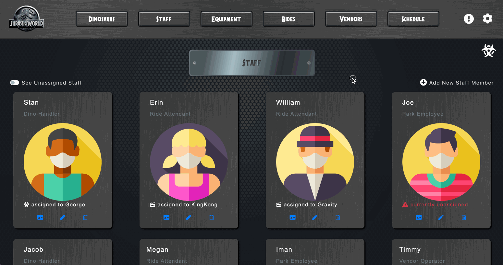

# Jurassic World

This is Jurassic World! With this Web App you can do many things. To start, there are 6 sections, the Dinosaurs, Staff, Equipment, Rides, Vendors, and Schedule. These are viewable when the User is not signed in, and you can make changes when the User is signed in through Google.

The Chaos Monkey can strike at any time, you will never know! If he strikes, then he will either kidnap a Staff member, or break a piece of Equipment or Ride. Luckily, you can fix the broken Equipment/Rides. There is also a log of all the chaos the monkey has made. If you aren't a fan of the sounds, animations, or need that Chaos Monkey to go away, you can easily turn those off in your User Settings.

This project utilizes Firebase and Axios to create, read, update, and delete data from the real-time database. The project is primarily built with JavaScript, manipulating data on the DOM that is pulled from Firebase. Check out the deployed site and see all the many other features within this Web App.

## Preview

The Landing Page

---

The Chaos Monkey

---

Chaos Monkey Log and Staff Schedule

---

Adding New Staff Members

---

## Deployed Project

https://nutshell-riendeer.web.app/

## Clone the Repository
- Clone it 👉🏼 `$ git clone https://github.com/nss-evening-cohort-12/nutshell-reindeer.git`

- Install the dependencies 👉🏼 `$ npm install`

- Run `$ npm start`

## Technologies Used
    
